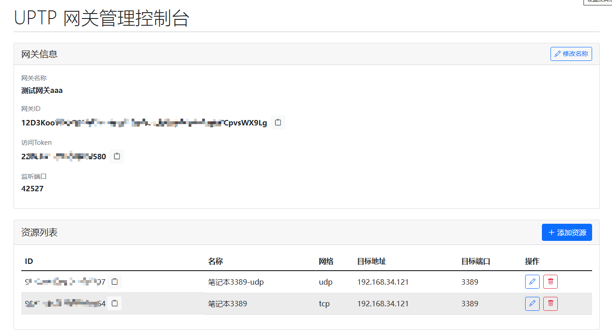
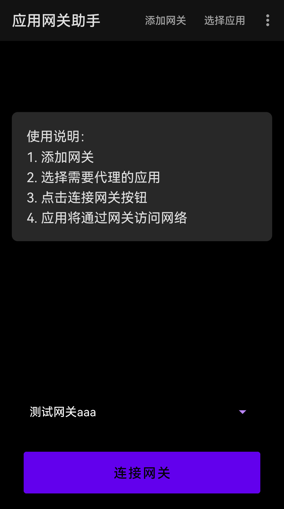
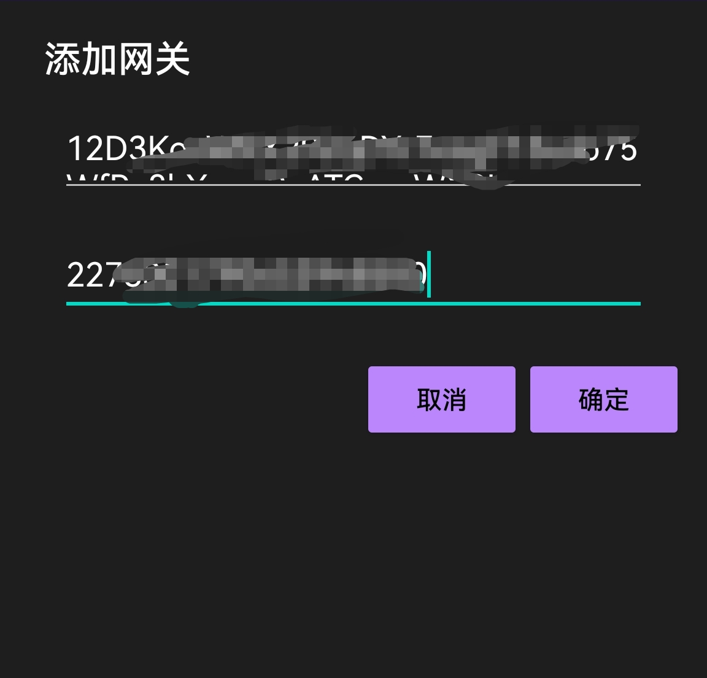
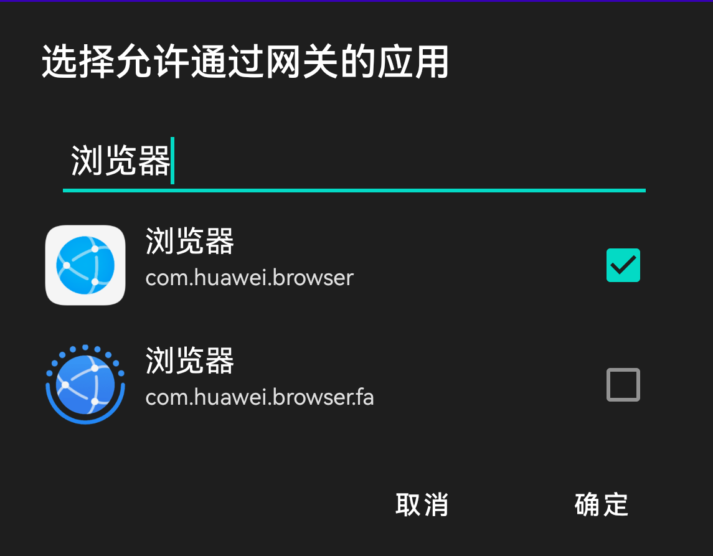
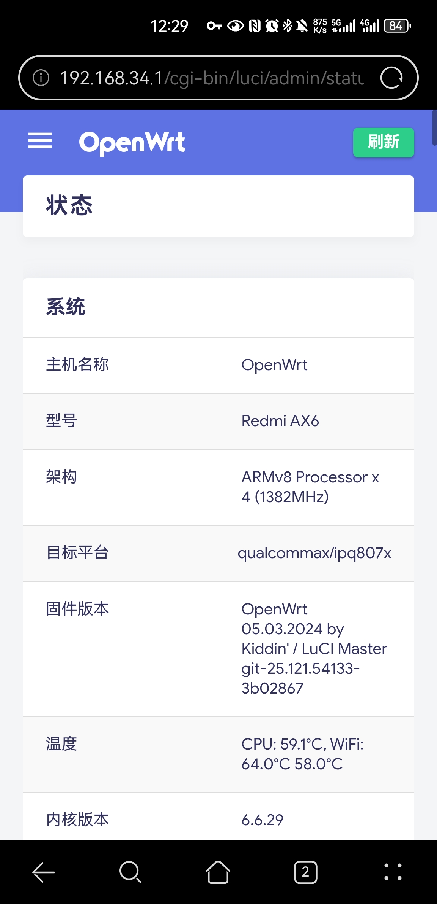
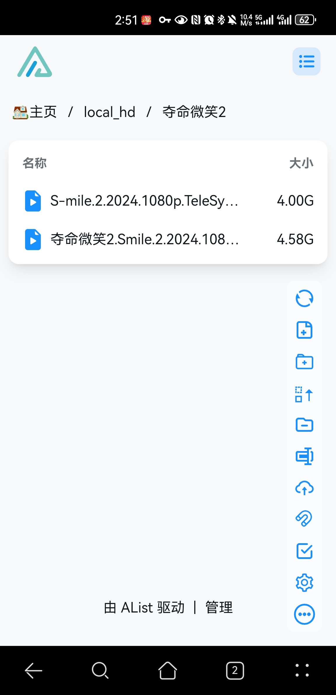

# UPTP 旨在打造一个低成本的、通用的点对点通信框架
现在的网络环境特别复杂，各种类型的NAT设备、防火墙设备等原因，导致点对点通信变得异常困难，目前一劳永逸的通用方案就是使用云服务器做中转。这种通用的代价就是昂贵的流量费用和带宽限制，有时还不可避免的带来高延时。

实际上有不少网络环境是支持P2P通信的，比如IPv6网络、部分NAT类型等。UPTP 的目标就是尽可能的利用这些网络环境，打造一个低成本的、通用的点对点通信框架，隐藏复杂的技术细节，向上层应用提供简单的通信接口，让开发者可以专注于业务逻辑。

打算分几个阶段实现,目前处于第一阶段
1、基于IPv6网络实现P2P通信
2、支持部分NAT类型下的P2P通信
3、支持中继服务器转发


另外，本项目不仅做框架，还一边做应用（自己相当于框架的第一个用户），目前实现的应用：
1、点对点的端口映射
2、手机应用网关

## 快速体验

### 1. 运行gateway
```bash
# Gateway 端启动（试用模式）
./uptp-gateway -trial -v

# Gateway 安装并启动（普通模式）
sudo ./uptp-gateway install
```
gateway web控制台：http://127.0.0.1:3000/


### 2. Android 应用网助手

下载并安装并打开APP



添加网关，填写网关控制台的网关ID、访问Token



选择要访问网关的APP，可以搜索过滤



连接完成后，上面选中的APP即可访问网关所在的网络资源，速度也杠杠的





## 常见问题

Q: 为什么连接失败？
A: 请检查两端IPv6网络是否通畅，防火墙是否放行相应端口

## 参与贡献
欢迎提交Pull Request或Issue报告问题

## 开发计划

- [ ] 开发移动端APP
- [ ] 支持IPv4 NAT穿透
- [ ] 添加macOS客户端支持
- [ ] 完善应用授权机制

## 许可证
MIT License