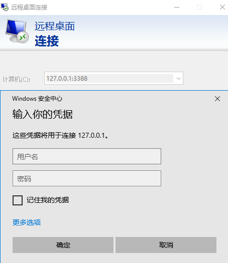

# UPTP (Universal P2P Transport Protocol)

UPTP是基于IPv6的内网穿透工具，无需自建云服务器、无需域名、无需DDNS，即可利用家庭宽带的IPv6能力实现内网穿透。

## 项目特点

- 纯IPv6 P2P连接，无需中转服务器
- 图形化界面操作简单
- 低延迟、高带宽传输

## 网络架构


## 快速开始

### 代码编译

1. 确保已安装Go 1.23+环境
2. 克隆项目仓库:
   ```bash
   git clone https://github.com/your-repo/uptp.git
   ```
3. 编译windows agent:
   ```bash
   cd uptp
   env CGO_ENABLED=0 GOOS=windows go build -ldflags '-w -c -H windowsgui' -o dist/uptp-agent_windows-amd64.exe ./agent/windows
   ```
4. 编译gateway：
   ```bash
   env CGO_ENABLED=0 GOOS=linux go build -ldflags '-w -c' -o dist/uptp-gateway_linux-amd64 ./gateway/cmd
   ```

## 快速体验

### 1. 运行gateway
```bash
# Gateway 端启动（试用模式）
./uptp-gateway -trial -v
```
gateway web控制台：http://127.0.0.1:3000/


### 2. 运行agent
运行uptp-agent.exe进入程序界面，添加应用即可


### 3. 访问应用


## 高级配置

### gateway端安装
```bash
# Linux系统服务安装
sudo ./uptp-gateway install
```


## 常见问题

Q: 为什么连接失败？
A: 请检查两端IPv6网络是否通畅，防火墙是否放行相应端口

## 参与贡献
欢迎提交Pull Request或Issue报告问题

## 开发计划

- [ ] 开发移动端APP
- [ ] 支持IPv4 NAT穿透
- [ ] 添加macOS客户端支持
- [ ] 完善应用授权机制

## 许可证
MIT License